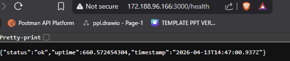

## Deskripsi Singkat Service

Membuat service aplikasi backend sederhana menggunakan **Node.js** yang berfungsi untuk menyediakan endpoint `/health`. Endpoint ini digunakan untuk mengecek apakah service berjalan dengan baik atau tidak.

Aplikasi ini dijalankan menggunakan **Docker container** dan dideploy ke **Virtual Machine (VPS)** sehingga dapat diakses secara publik melalui internet.

---

## Penjelasan Endpoint `/health`

Endpoint `/health` digunakan sebagai **health check** untuk memastikan bahwa service berjalan dengan normal.

### Detail Endpoint:

- Method: `GET`
- URL: `/health`

### Penjelasan:

- `status`: Menunjukkan status service
- `uptime`: Lama service berjalan
- `timestamp`: Waktu saat request dilakukan

Endpoint ini akan mengembalikan status **HTTP 200 OK** jika service berjalan dengan baik.

---

## Screenshot / Bukti Endpoint

Endpoint dapat diakses secara publik melalui:

```bash
http://172.188.96.166:3000/health
```



Sudah bisa diakses dsecara publik

---

## Penjelasan Proses Build dan Run Docker

Aplikasi dikemas menggunakan Docker dengan langkah sebagai berikut:

### 1. Build Image

```bash
docker compose build
```

### 2. Menjalankan Container

```bash
docker compose up -d
```

### Penjelasan:

- Dockerfile menggunakan **multi-stage build** untuk optimasi ukuran image
- Base image menggunakan **node:20-alpine** agar ringan
- Container menjalankan aplikasi pada port `3000`
- Menggunakan **restart policy** agar container tetap berjalan
- Menggunakan **HEALTHCHECK** untuk memonitor kondisi service

---

## Penjelasan Proses Build dan Run Docker

Command:

```bash
docker compose up -d --build
```

Diakses melalui:

```bash
http://172.188.96.166:3000/health
```

- Docker membaca konfigurasi docker-compose.yml
- Melakukan build image Dockerfile (multi-stage build)
- Menjalankan container
- Menghubungkan port 3000 dari container ke host
- Mengaktifkan restart policy (unless-stopped)

## Kendala yang Dihadapi

Mencari VPS yang gratis

---
